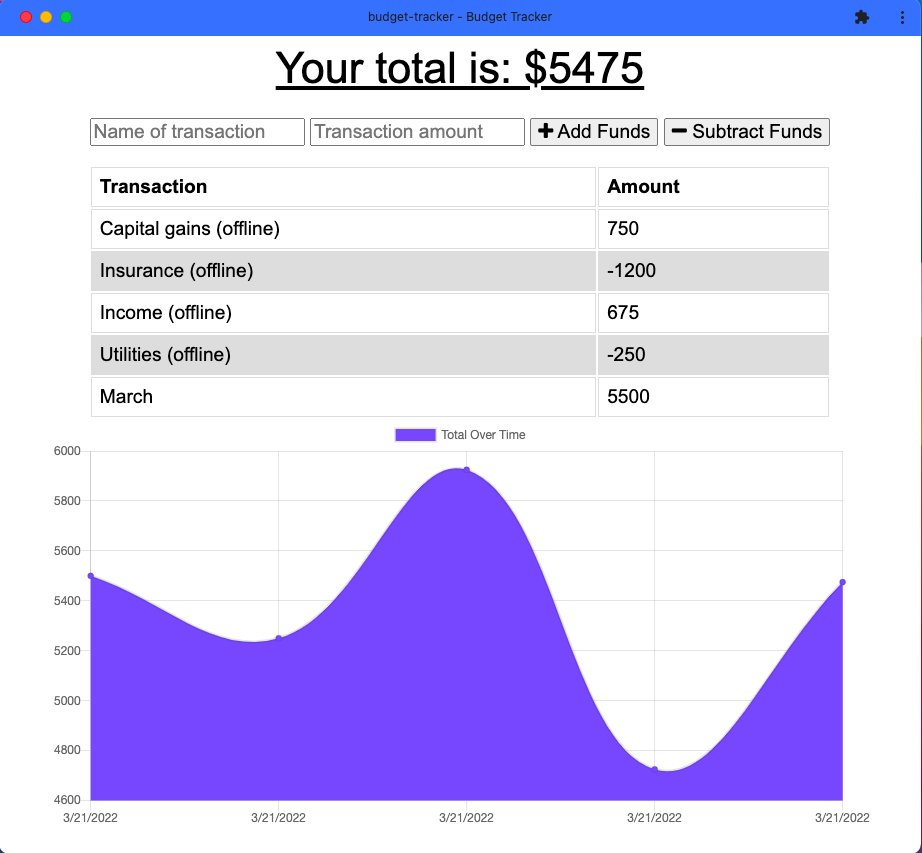

# Budget Tracker

This budget tracking pregressive web app (PWA) allows users to install the app on their device and maintains most of it's functionality for adding transactions, when the app has limited to no network connectivity.

## Index

- [Installation](#installation)
- [License](#license)
- [Built With](#built-with)
- [Questions](#questions)

## Installation
[^](#index)

DESKTOP
In the address bar of your browser, look for the icon with the computer screen with an arrow pointing downward. Click on it to install the app.

MOBILE
Look for the add budget to Home screen option from the webpage.

## License
[^](#index)

## Built With
[^](#index)

## Questions

Feel free to contact me using the information below!

- GitHub Profile: [@scottrohrig](https://github.com/scottrohrig)

- Email: scott.rohrig@gmail.com

- Project Repository/URL: [github.com/.../budget-tracker](https://github.com/scottrohrig/budget-tracker)
